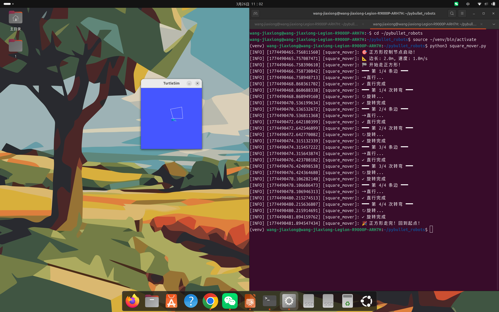
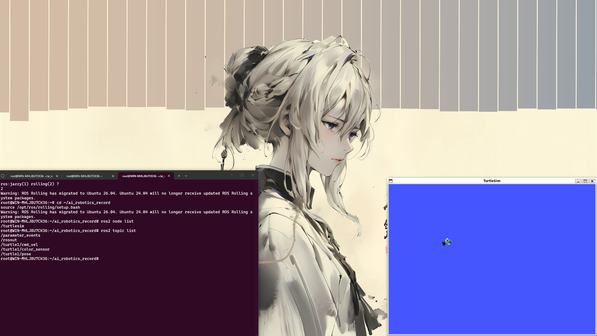

# Week 02 — Ubuntu 与 ROS2 环境搭建

## 实验目标

搭建 Ubuntu + ROS2 基础开发环境，通过 turtlesim 验证安装是否成功，为后续课程做好准备。

## 实验环境

| 组件 | 说明 |
|------|------|
| 操作系统 | Ubuntu 24.04 LTS（WSL2） |
| ROS2 版本 | Jazzy / Humble |
| 仿真工具 | turtlesim |
| 开发工具 | VS Code、终端 |

## 目录结构

```
Week02/
├── README.md            # 本报告
├── turtlesim_start.png  # turtlesim 启动截图
├── node_list.png        # ros2 node list 截图
├── topic_list.png       # ros2 topic list 截图
├── circle.png           # 乌龟画圆截图
└── xiaowugui.png        # 小乌龟运行截图
```

## 实验步骤

### 1. 安装 WSL2 与 Ubuntu

在 Windows 上启用 WSL2 并安装 Ubuntu 24.04 LTS：

```powershell
wsl --install -d Ubuntu-24.04
```

### 2. 安装 ROS2

添加 ROS2 仓库并安装桌面版：

```bash
sudo apt update
sudo apt install ros-jazzy-desktop
```

### 3. 配置环境

将 ROS2 环境脚本加入 `.bashrc`，使每次打开终端自动加载：

```bash
echo "source /opt/ros/jazzy/setup.bash" >> ~/.bashrc
source ~/.bashrc
```

### 4. 验证安装

启动 turtlesim 并检查节点/话题是否正常：

```bash
# 终端 1：启动 turtlesim
ros2 run turtlesim turtlesim_node

# 终端 2：验证节点和话题
ros2 node list
ros2 topic list
```

### 5. 测试乌龟运动

让乌龟画圆，验证环境完整可用：

```bash
ros2 topic pub /turtle1/cmd_vel geometry_msgs/msg/Twist "{linear: {x: 2.0}, angular: {z: 2.0}}"
```

## 关键命令

```bash
# 加载 ROS2 环境
source /opt/ros/jazzy/setup.bash

# 启动 turtlesim
ros2 run turtlesim turtlesim_node

# 查看节点
ros2 node list

# 查看话题
ros2 topic list

# 让乌龟画圆
ros2 topic pub /turtle1/cmd_vel geometry_msgs/msg/Twist "{linear: {x: 2.0}, angular: {z: 2.0}}"
```

## 实验证据

### Turtlesim 启动



*ROS2 turtlesim 启动成功，小乌龟出现在窗口中央*

### ROS2 节点列表


*`ros2 node list` 输出 turtlesim 相关节点*

### ROS2 话题列表



*`ros2 topic list` 显示 /turtle1/cmd_vel 等话题正常注册*

### 乌龟画圆


*通过发布 Twist 消息让乌龟画出圆形轨迹，验证环境完全可用*

### 完整环境截图


*多终端协作验证 ROS2 运行状态*

## 遇到的问题与解决

| 问题 | 原因 | 解决方案 |
|------|------|----------|
| `ros2: command not found` | 未 source setup.bash | 执行 `source /opt/ros/jazzy/setup.bash` 或加入 `.bashrc` |
| WSL2 中 GUI 无法显示 | 缺少 X Server | 安装 VcXsrv 或使用 WSLg（Windows 11 自带） |
| `apt install ros-jazzy-desktop` 404 | 未添加 ROS2 apt 仓库 | 先添加 ROS2 官方源和 GPG key |
| 安装速度慢 | 默认源在海外 | 更换为国内镜像源（清华/中科大） |

## 总结与反思

### 核心收获

1. **环境是第一关**：ROS2 的安装看似简单，但涉及 WSL2 网络配置、apt 源选择、环境变量设置等多个环节。本次踩过的每个坑都是后续课程的基础设施保障
2. **turtlesim 是试金石**：小乌龟能跑起来 = ROS2 安装成功，比任何诊断命令都直观。这一方法贯穿了整个课程
3. **命令行思维**：从 VS Code 到终端到 ROS2 CLI，Linux 命令行不是障碍而是效率工具

### 延伸思考

环境搭建是最容易被忽视但最重要的环节。一个稳定的 ROS2 环境支撑了后续 12 周的实验。WSL2 + Ubuntu + ROS2 这套组合是 Windows 用户进行机器人开发的最优方案——既享受了 Windows 的日常便利，又获得了 Linux 的原生 ROS2 支持。

---

[返回实验导航](../README.md)
