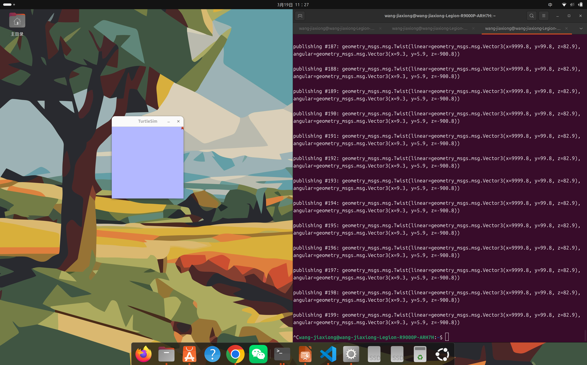

# Week 03 — ROS2 话题通信与乌龟控制

## 实验目标

通过 ROS2 话题发布 `geometry_msgs/Twist` 消息控制 turtlesim 小乌龟运动，理解发布者/订阅者模型和话题通信机制。同时练习使用 Python 编写 ROS2 控制节点。

## 实验环境

| 组件 | 说明 |
|------|------|
| 中间件 | ROS2 Humble / Jazzy |
| 仿真器 | turtlesim |
| 消息类型 | `geometry_msgs/msg/Twist` |
| 编程语言 | Python 3 + rclpy |

## 目录结构

```
Week03/
├── README.md         # 本报告
├── turtle_control.py # Python 控制节点
├── dawugui.png       # 大乌龟控制截图
├── python_run.png    # Python 程序运行截图
└── rectangle.png     # 长方形轨迹截图
```

## 实验步骤

### 1. 启动 turtlesim

```bash
ros2 run turtlesim turtlesim_node
```

### 2. 命令行发布速度指令

直接通过命令行发布 Twist 消息控制乌龟：

```bash
ros2 topic pub /turtle1/cmd_vel geometry_msgs/msg/Twist "{linear: {x: 2.0}, angular: {z: 1.8}}"
```

### 3. Python 节点控制

编写 Python 程序通过 rclpy 创建发布者节点，实现自动化控制：

```bash
python3 turtle_control.py
```

### 4. 观察话题通信

使用 `ros2 topic` 系列命令查看话题状态和消息流向：

```bash
ros2 topic list           # 列出所有话题
ros2 topic info /turtle1/cmd_vel  # 查看话题详情
ros2 topic echo /turtle1/pose     # 监听位姿信息
```

## 关键命令

```bash
# 启动 turtlesim
ros2 run turtlesim turtlesim_node

# 发布速度指令（直线前进 + 旋转）
ros2 topic pub /turtle1/cmd_vel geometry_msgs/msg/Twist "{linear: {x: 2.0}, angular: {z: 1.8}}"

# 查看话题消息类型
ros2 topic info /turtle1/cmd_vel

# 运行 Python 控制程序
python3 turtle_control.py
```

## ROS2 话题通信模型

```
Publisher (控制程序)  →  /turtle1/cmd_vel (Twist)  →  Subscriber (turtlesim)
                          linear.x  = 前进速度
                          angular.z = 旋转速度
```

发布者/订阅者模型的核心优势是**解耦**——控制程序不需要知道 turtlesim 的内部实现，只需按标准消息格式发布指令。这种松耦合架构使得 ROS2 系统可以灵活替换组件。

## 实验证据

### 命令行控制


*通过命令行发布 Twist 消息控制 turtlesim 运动*

## 遇到的问题与解决

| 问题 | 原因 | 解决方案 |
|------|------|----------|
| `ros2 topic pub` 只发送一次消息 | 默认发送单条消息后退出 | 添加 `--once` 或 `--rate` 参数持续发布 |
| Python 节点运行报 `ModuleNotFoundError` | rclpy 未安装或环境未 source | 确保 `source /opt/ros/humble/setup.bash` 并安装 `ros-humble-rclpy` |
| 乌龟不按预期轨迹运动 | 线速度和角速度的时序配比不对 | 精确计算每段运动所需的时间：时间 = 距离/速度，角度 = 角速度×时间 |
| topic echo 无输出 | 话题名称拼写错误 | 使用 Tab 补全或 `ros2 topic list` 确认准确名称 |

## 总结与反思

### 核心收获

1. **发布/订阅模型**：这是 ROS2 最核心的通信范式，也是分布式机器人系统的基础。理解 Topic → Message → Publisher/Subscriber 三者关系后，控制任何机器人都遵循同一模式
2. **Twist 消息**：`linear.x`（前进）和 `angular.z`（旋转）是移动机器人最基础的控制量，从 turtlesim 到真实差速小车都通用
3. **Python 与 ROS2 集成**：`rclpy` 让 Python 能直接创建 ROS2 节点，比命令行灵活得多，支持条件判断和循环

### 延伸思考

学会了控制小乌龟，就学会了控制任何移动机器人。后续 Week07 的正方形轨迹练习和 Week13 的迷宫探索，本质上都是在发布 `cmd_vel` 指令——只是决策逻辑从"固定序列"升级为"自主判断"。

---



*补充截图：Python 控制节点运行*

[返回实验导航](../README.md)
