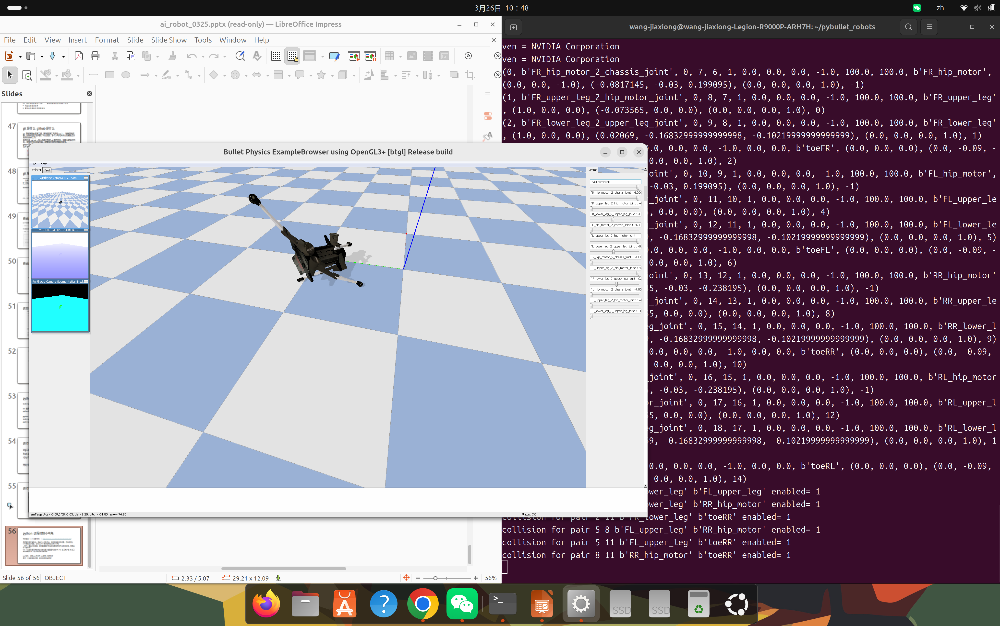

# Week 04 — PyBullet 四足机器人仿真

## 实验目标

使用 PyBullet 物理引擎加载并观察四足机器人模型，理解仿真环境的基本构成要素（世界、模型、物理参数），为后续步态控制和强化学习打下仿真基础。

## 实验环境

| 组件 | 说明 |
|------|------|
| 仿真引擎 | PyBullet |
| 编程语言 | Python 3 |
| 机器人模型 | Laikago URDF（四足机器人） |
| 物理参数 | 重力、地面摩擦、关节力矩 |

## 目录结构

```
Week04/
├── README.md           # 本报告
├── kinematics_demo.py       # 四足机器人仿真程序
├── dog.png             # 仿真截图
├── kinematics_run.png  # 运动学运行截图
└── pose_echo.png       # 位姿话题监听截图
```

## 实验步骤

### 1. 安装 PyBullet

```bash
pip install pybullet
```

### 2. 创建仿真世界

初始化 PyBullet 物理引擎，设置重力参数和地面平面：

```python
import pybullet as p
p.connect(p.GUI)
p.setGravity(0, 0, -9.8)
p.loadURDF("plane.urdf")
```

### 3. 加载四足机器人

加载 Laikago 四足机器人 URDF 模型，观察其在重力作用下的初始姿态：

```python
robot_id = p.loadURDF("laikago/laikago.urdf", [0, 0, 0.5])
```

### 4. 仿真循环

在循环中步进仿真，观察机器人状态变化：

```python
while True:
    p.stepSimulation()
    time.sleep(1./240.)
```

### 5. 位姿监控

通过 ROS2 话题监听机器人位姿（里程计）数据：

```bash
ros2 topic echo /robot/odom
```

## 关键命令

```bash
# 安装依赖
pip install pybullet numpy

# 运行仿真
python3 kinematics_demo.py
```

## 实验证据

### 四足机器人仿真



*Laikago 四足机器人模型在 PyBullet 仿真环境中成功加载*


*Laikago 四足机器人模型在 PyBullet 仿真环境中成功加载*


*Laikago 四足机器人模型在 PyBullet 仿真环境中成功加载*


*Laikago 四足机器人模型在 PyBullet 仿真环境中成功加载*

## 遇到的问题与解决

| 问题 | 原因 | 解决方案 |
|------|------|----------|
| `import pybullet` 失败 | PyBullet 未安装或 Python 版本不兼容 | 使用 `pip install pybullet`，确认 Python ≥ 3.8 |
| 机器人穿透地面坠落 | URDF 初始高度设置为 0 | 将 spawn 位置 z 坐标设为机器人大约高度（如 0.5m） |
| GUI 窗口无响应 | 仿真循环中未调用 `stepSimulation` | 确保循环中包含 `p.stepSimulation()` 和适当的 `time.sleep` |
| URDF 文件找不到 | 路径配置错误 | 确认 URDF 文件路径，使用绝对路径或相对于脚本目录的路径 |

## 总结与反思

### 核心收获

1. **仿真世界三要素**：物理引擎（PyBullet）+ 机器人模型（URDF）+ 控制逻辑（Python），三者组合即可搭建任意机器人仿真场景
2. **URDF 的重要性**：URDF 是机器人模型的通用描述格式，包含关节、连杆、质量、惯性等物理属性——模型精度直接决定仿真可信度
3. **仿真步进**：`stepSimulation()` 是仿真的心脏，每次调用推进一个物理时间步。步长太大导致不稳定，太小浪费计算——240Hz 是常用选择

### 延伸思考

本实验只是让机器人"站在地上"。从 Week13 的步态控制到 Week14 的强化学习爬楼梯，都是在同一个仿真框架上叠加控制算法。理解这个基础框架后，添加任何控制逻辑（PID、步态生成器、PPO 策略）都只是替换控制循环中的"决策"部分。

---

[返回实验导航](../README.md)
