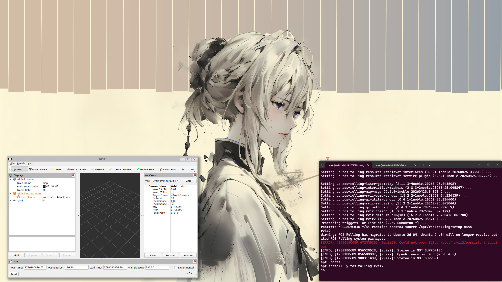

# Week 05 — 机械臂逆运动学与视觉仿真

## 实验目标

在 PyBullet 中搭建机械臂仿真场景，实现逆运动学（IK）求解，并通过虚拟相机（RGB / 深度 / 分割）观察仿真结果，理解机器人视觉伺服的基本概念。

## 实验环境

| 组件 | 说明 |
|------|------|
| 仿真引擎 | PyBullet |
| 编程语言 | Python 3 |
| 运动学 | 逆运动学（IK）求解器 |
| 视觉传感器 | RGB 相机、深度相机、分割相机 |
| 可视化 | RViz2（ROS2 端） |

## 目录结构

```
Week05/
├── README.md           # 本报告
├── arm_ik.py           # 机械臂逆运动学程序
├── jixiebi.webm        # 机械臂运动视频
├── rviz_start.png      # RViz2 启动截图
└── rviz_topic.png      # RViz2 话题配置截图
```

## 实验步骤

### 1. 搭建机械臂仿真场景

在 PyBullet 中加载机械臂 URDF 模型，设置初始关节角度和重力环境。

### 2. 逆运动学求解

给定末端执行器的目标位姿（位置 + 方向），使用 PyBullet 内置 IK 求解器计算各关节角度：

```bash
python3 arm_ik.py
```

### 3. 虚拟相机配置

在仿真场景中放置 RGB、深度和分割相机，从不同视角观察机械臂运动。

### 4. ROS2 可视化

将仿真数据发布到 ROS2 话题，在 RViz2 中实时观察机械臂状态。

## 关键命令

```bash
# 安装 PyBullet
pip install pybullet

# 运行逆运动学仿真
python3 arm_ik.py

# RViz2 可视化
rviz2
```

## 逆运动学原理

逆运动学（Inverse Kinematics）求解的问题是：**给定末端位置 → 求各关节角度**。

与正运动学（已知关节角度 → 求末端位置）相反，IK 更贴近实际应用场景（"我要让手到达那个位置"）。PyBullet 使用数值迭代方法求解 IK，核心 API：

```python
joint_positions = p.calculateInverseKinematics(
    robot_id, end_effector_index, target_position
)
```

## 实验证据

### 机械臂运动视频

[▶ 机械臂逆运动学实验视频](images/jixiebi.webm)

*机械臂从初始姿态运动到 IK 求解的目标位姿*

## 遇到的问题与解决

| 问题 | 原因 | 解决方案 |
|------|------|----------|
| IK 求解返回异常角度 | 目标位置超出机械臂工作空间 | 限制目标位置在可达范围内，或使用 `joint_limits` 约束 |
| 虚拟相机画面全黑 | 相机位置或朝向不正确 | 调整相机的 `viewMatrix` 和 `projectionMatrix` 参数 |
| 机械臂关节抖动 | IK 求解器产生不连续解 | 对相邻帧的关节角度进行平滑插值 |
| RViz2 收不到数据 | 未配置正确的 TF 变换 | 发布 `robot_state_publisher` 和静态 TF |

## 总结与反思

### 核心收获

1. **IK vs FK**：逆运动学解决的是机器人控制中最核心的问题——"我想让手去那里，关节该怎么转？"PyBullet 的 `calculateInverseKinematics` 封装了复杂的数值求解
2. **多模态感知**：RGB 相机看图、深度相机测距、分割相机识别物体——三种视觉传感器各司其职，组合使用才能实现完整的视觉伺服
3. **仿真先行**：在 PyBullet 中调试 IK 算法，避免了真实机械臂损坏的风险

### 延伸思考

机械臂 + 视觉 = 智能抓取。从本实验的逆运动学基础出发，结合 Week10 的 OpenCV 和 Week12 的 ArUco 定位，可以构建完整的「视觉识别目标 → 计算抓取位姿 → IK 求解 → 机械臂执行」抓取流水线。

---



*补充截图：RViz2 可视化*

[返回实验导航](../README.md)
