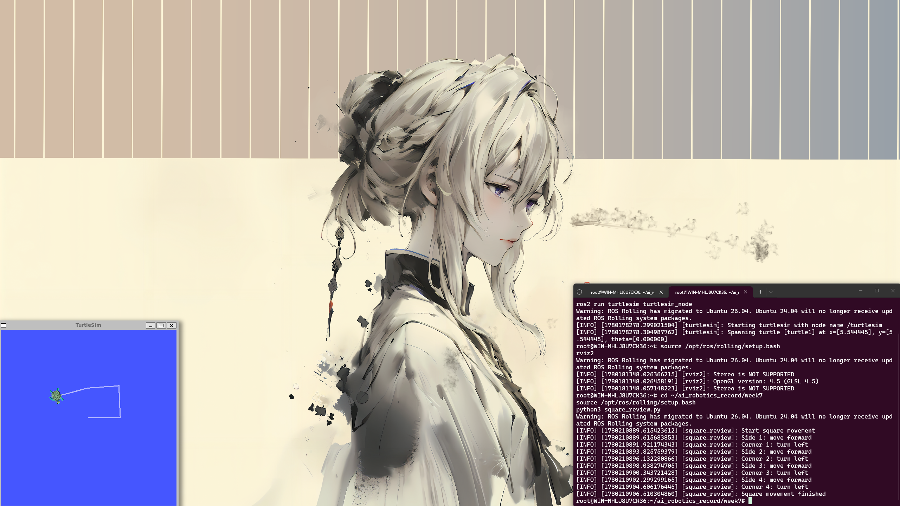

# Week 7：前半学期复习与模拟练习

## 实验基本信息

- **课程**：AI Robotics
- **主题**：半学期复习——ROS2 命令、Python 节点、运动学、PID 控制
- **实验工具**：ROS2 Humble / Jazzy、turtlesim、Python 3、rclpy

---

## 实验内容

本周主要复习前半学期内容，包括 ROS2 基本命令、Python 节点编程、机器人运动学、传感器、RViz 和 PID 控制。通过控制小乌龟走正方形轨迹，综合应用前半学期所学知识。

---

## 1. ROS2 常用命令复习

启动 turtlesim 仿真节点：

```bash
ros2 run turtlesim turtlesim_node
```

查看节点：

```bash
ros2 node list
```

查看话题：

```bash
ros2 topic list
```

监听位置信息：

```bash
ros2 topic echo /turtle1/pose
```

发布速度命令：

```bash
ros2 topic pub /turtle1/cmd_vel geometry_msgs/msg/Twist "{linear: {x: 1.0}, angular: {z: 0.0}}"
```

---

## 2. Python 节点练习

本周练习使用 Python 程序控制小乌龟走正方形。核心思路是利用 `rclpy` 创建 ROS2 节点，通过发布 `cmd_vel` 话题控制小乌龟沿正方形轨迹运动。

### 代码实现 (`square_review.py`)

```python
import rclpy
from rclpy.node import Node
from geometry_msgs.msg import Twist
import time


class SquareReview(Node):
    def __init__(self):
        super().__init__('square_review')
        self.publisher = self.create_publisher(Twist, '/turtle1/cmd_vel', 10)

    def move(self, linear_x, angular_z, duration):
        msg = Twist()
        msg.linear.x = linear_x
        msg.angular.z = angular_z

        start = time.time()
        while time.time() - start < duration:
            self.publisher.publish(msg)
            time.sleep(0.1)

        self.publisher.publish(Twist())
        time.sleep(0.3)

    def run_square(self):
        self.get_logger().info('Start square movement')

        for i in range(4):
            self.get_logger().info(f'Side {i + 1}: move forward')
            self.move(1.0, 0.0, 2.0)

            self.get_logger().info(f'Corner {i + 1}: turn left')
            self.move(0.0, 1.0, 1.57)

        self.get_logger().info('Square movement finished')


def main():
    rclpy.init()
    node = SquareReview()
    time.sleep(1)
    node.run_square()
    node.destroy_node()
    rclpy.shutdown()


if __name__ == '__main__':
    main()
```

运行命令：

```bash
python3 square_review.py
```

程序会让小乌龟沿正方形轨迹行走 4 条边，每走完一条边后左转 90°（约 1.57 弧度）。

---

## 3. 运动学计算

已知左轮速度 0.5 m/s，右轮速度 1.5 m/s，轮间距 0.5 m。

**线速度计算：**

```
v = (v_left + v_right) / 2
v = (0.5 + 1.5) / 2 = 1.0 m/s
```

**角速度计算：**

```
ω = (v_right - v_left) / L
ω = (1.5 - 0.5) / 0.5 = 2.0 rad/s
```

这组参数下，机器人以 1.0 m/s 的线速度前进，同时以 2.0 rad/s 的角速度左转。通过调节左右轮速度差可以控制转向方向和幅度。

---

## 4. PID 控制复习

| 分量 | 含义 | 作用 |
|------|------|------|
| **P（比例）** | 根据当前误差调整输出 | 误差越大，修正力越强 |
| **I（积分）** | 根据历史误差累积进行修正 | 消除稳态误差 |
| **D（微分）** | 根据误差变化速度调整 | 减少震荡，提高稳定性 |

PID 是机器人运动控制最基础也最重要的算法之一，广泛应用于速度控制、轨迹跟踪等场景。

---

## 实验截图

### 小乌龟正方形轨迹



---

## English Summary

In Week 7, I reviewed the key concepts from the first half of the semester: ROS2 basic commands, Python node programming, robot kinematics, and PID control. I implemented a square trajectory controller that commands the turtlesim robot to move along a square path by publishing `cmd_vel` messages. The kinematics calculation demonstrated the relationship between wheel speeds and robot motion (v = 1.0 m/s, ω = 2.0 rad/s). This review helped consolidate my understanding of the fundamental ROS2 development workflow.

---

## 한국어 요약

7주차에는 학기 전반부의 핵심 개념인 ROS2 기본 명령어, Python 노드 프로그래밍, 로봇 운동학 및 PID 제어를 복습하였다. `cmd_vel` 메시지를 퍼블리시하여 turtlesim 로봇이 정사각형 경로를 따라 이동하도록 제어하는 프로그램을 구현하였으며, 바퀴 속도와 로봇 운동 간의 관계(v = 1.0 m/s, ω = 2.0 rad/s)를 운동학 계산을 통해 확인하였다. 이번 복습을 통해 ROS2 개발 워크플로우의 기초를 확립할 수 있었다.
