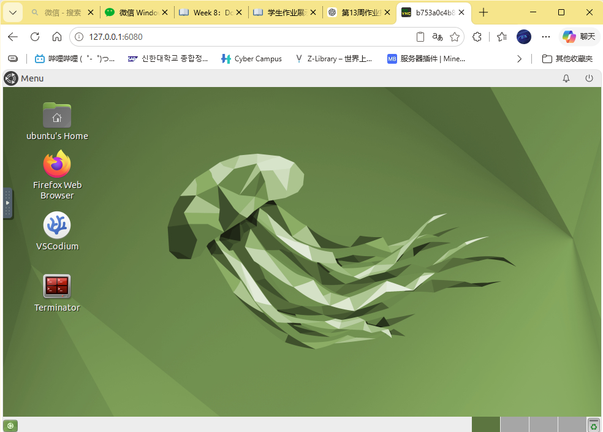
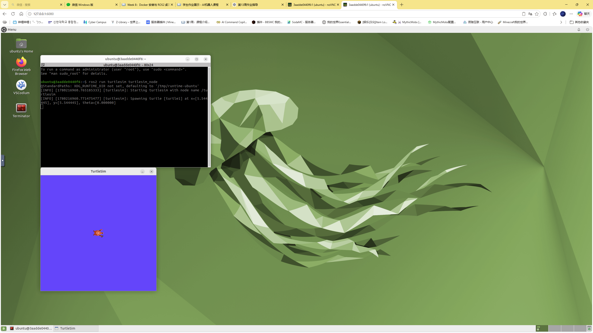

# Week 08 — Docker 与 ROS2 桌面容器

## 实验目标

使用 Docker 拉取并运行 ROS2 桌面容器，通过浏览器 VNC 访问完整 ROS2 图形化环境，体验容器化部署在机器人开发中的优势。

## 实验环境

| 组件 | 说明 |
|------|------|
| 容器引擎 | Docker |
| 镜像 | `tiryoh/ros2-desktop-vnc:humble` |
| 远程桌面 | noVNC（浏览器访问） |
| ROS2 版本 | Humble |
| 端口映射 | 6080（VNC）、8080（Web 服务） |

## 目录结构

```
Week08/
├── README.md             # 本报告
├── docker_desktop.png    # Docker 桌面启动截图
├── docker_turtlesim.png  # 容器内 Turtlesim 运行截图
└── vnc_page.png          # noVNC 浏览器访问截图
```

## 实验步骤

### 1. 拉取 ROS2 桌面镜像

从 Docker Hub 获取预构建的 ROS2 桌面环境镜像：

```bash
docker pull tiryoh/ros2-desktop-vnc:humble
```

### 2. 启动容器

映射 noVNC 端口到宿主机，使浏览器可访问容器内桌面：

```bash
docker run -it --rm -p 6080:80 tiryoh/ros2-desktop-vnc:humble
```

### 3. 浏览器访问

打开 `http://localhost:6080`，通过 noVNC 进入容器内的完整 Linux 桌面环境。

### 4. 运行 ROS2 工具

在容器桌面中启动终端，运行 turtlesim 等 ROS2 图形化工具进行验证。

## 关键命令

```bash
# 拉取镜像
docker pull tiryoh/ros2-desktop-vnc:humble

# 启动容器（基础模式）
docker run -it --rm -p 6080:80 tiryoh/ros2-desktop-vnc:humble

# 启动容器（挂载工作目录）
docker run -it --rm -p 6080:80 -v $(pwd):/workspace tiryoh/ros2-desktop-vnc:humble

# 容器内启动 turtlesim
ros2 run turtlesim turtlesim_node
```

## 实验证据

### Docker 桌面环境



*Docker 容器成功启动，noVNC 连接正常*

### 容器内 Turtlesim



*在 Docker 容器中成功运行 turtlesim，验证 ROS2 环境正常*

*通过浏览器直接访问容器桌面，无需安装任何客户端*

## 遇到的问题与解决

| 问题 | 原因 | 解决方案 |
|------|------|----------|
| 容器启动后立即退出 | 未使用 `-it` 分配伪终端 | 添加 `-it` 参数保持交互模式 |
| 端口 6080 被占用 | 其他服务占用了该端口 | 更换映射端口如 `-p 6081:80` |
| 容器内无法显示图形 | 未安装显示服务 | 使用 noVNC 方案，在浏览器中查看桌面 |
| 文件修改在容器重启后丢失 | 未使用卷挂载 | 用 `-v` 将工作目录挂载到容器内 |

## 总结与反思

### 核心收获

1. **Docker 的优势**：一行命令即可在任何机器上复现完整的 ROS2 开发环境，彻底解决"环境配置地狱"问题。对课程中频繁切换电脑/WSL 的场景尤其有用
2. **noVNC 方案**：不需要在本机安装 X11 或 VNC 客户端，浏览器即可访问完整桌面，跨平台体验极佳
3. **容器化思维**：将开发环境、依赖、工具全部打包进镜像，实现了"环境即代码"

### 延伸思考

Docker 容器化是机器人开发从单机走向分布式的重要基础：
- 可以为每个 ROS2 节点创建独立容器，通过 Docker 网络实现分布式通信
- 多机器人仿真场景中，每个机器人可运行在独立容器中
- 后续 Week13/14 的项目正是基于此方案实现了 ROS2 + PyBullet 的容器化部署

---


*补充截图：Docker 容器管理*

[返回实验导航](../README.md)
