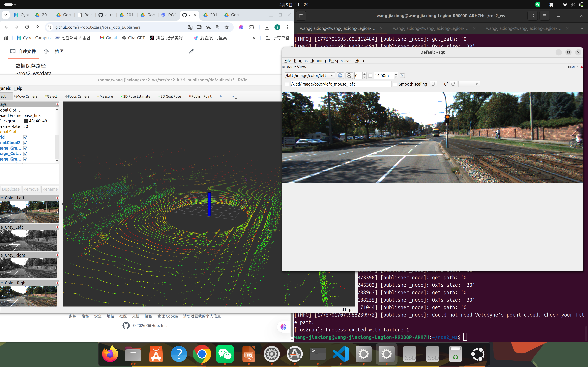

# Week 10 — Docker 与 OpenCV 实验

## 实验目标

在 Docker 工作流中验证 OpenCV 功能，并记录视觉实验输出。

## 目录结构

<pre>
Week10/
|-- README.md              # 周实验报告
|-- opencv-result.png      # 视觉截图
</pre>

## 实验环境

- Docker
- Python
- OpenCV

## 实验流程

1. 检查 Docker 容器与镜像。
2. 运行 OpenCV 验证。
3. 保存输出证据。

## 命令

<pre><code class="language-bash">
python3 opencv_test.py
docker ps
docker images
</code></pre>

## 实验证据

## 总结与反思

OpenCV 为后续相机相关实验提供了计算机视觉的基础能力。

---

[返回实验导航](../README.md)
