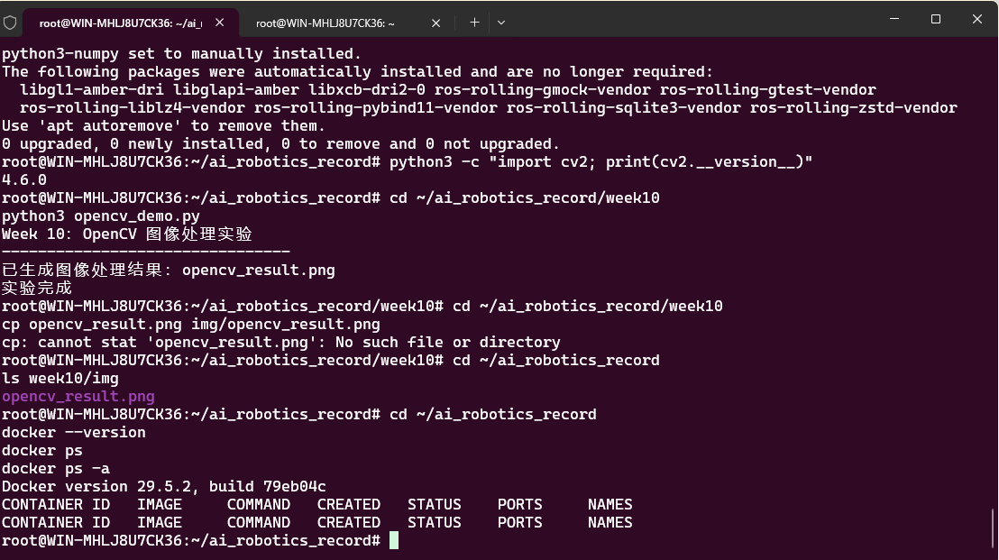
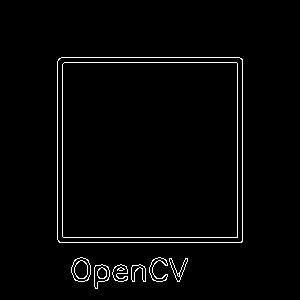

# Week 10 — Docker 进阶与 OpenCV 视觉实验

## 实验目标

在 Docker 容器中运行 OpenCV 视觉处理程序，掌握 Docker 环境下的依赖管理和图形输出，为后续 ROS2 + 视觉项目打下容器化基础。

## 实验环境

| 组件 | 说明 |
|------|------|
| 容器引擎 | Docker |
| 编程语言 | Python 3 |
| 视觉库 | OpenCV |
| 操作系统 | Ubuntu（容器内） |

## 目录结构

```
Week10/
├── README.md             # 本报告
├── opencv_test.py        # OpenCV 验证程序
├── opencv-result.png     # 图像处理结果
├── docker_command.png    # Docker 命令执行截图
└── opencv_result.png     # 视觉实验输出
```

## 实验步骤

### 1. Docker 环境准备

检查 Docker 服务状态，确认镜像和容器管理命令可用：

```bash
docker ps       # 查看运行中的容器
docker images   # 查看本地镜像列表
```

### 2. 构建 OpenCV 运行环境

在容器中安装 OpenCV 及其依赖：

```bash
docker run -it --rm -v $(pwd):/workspace python:3.10 bash
pip install opencv-python numpy
```

### 3. 运行 OpenCV 验证程序

编写并运行图像处理测试程序，验证 OpenCV 在容器中的功能正常：

```bash
python3 opencv_test.py
```

### 4. 输出验证

将处理结果保存为图片文件，确认容器挂载目录正常同步。

## 关键命令

```bash
# 查看 Docker 状态
docker ps
docker images

# 拉取 Python 镜像
docker pull python:3.10

# 挂载工作目录运行容器
docker run -it --rm -v $(pwd):/workspace python:3.10 python3 opencv_test.py
```

## 实验证据

### Docker 命令执行



*容器状态检查，确认环境正常运行*

### OpenCV 处理结果



*OpenCV 图像处理成功输出*


n

*视觉实验最终输出结果*

## 遇到的问题与解决

| 问题 | 原因 | 解决方案 |
|------|------|----------|
| 容器内 `import cv2` 报错 | OpenCV 未安装或版本不兼容 | 使用 `pip install opencv-python-headless` 避免 GUI 依赖冲突 |
| 输出文件在宿主机不可见 | 未正确挂载工作目录 | 使用 `-v $(pwd):/workspace` 确保双向同步 |
| 容器退出后文件丢失 | 使用了 `--rm` 但未先保存输出 | 确保在容器退出前将结果写入挂载目录 |
| 镜像拉取速度慢 | 默认 Docker Hub 源在境内较慢 | 配置国内镜像加速器 |

## 总结与反思

### 核心收获

1. **Docker 挂载机制**：`-v` 参数是实现宿主机 ↔ 容器文件共享的关键，理解双向绑定对后续 ROS2 项目至关重要
2. **无头模式**：在容器中运行视觉程序，需使用 `opencv-python-headless` 代替完整版 OpenCV，避免缺少显示服务导致崩溃
3. **环境一致性**：Docker 确保不同机器上运行相同的 OpenCV 版本和依赖，消除了"在我电脑上能跑"的问题

### 延伸思考

Docker + OpenCV 的组合是机器人视觉开发的标准范式：
- 可提前构建包含 OpenCV + ROS2 的定制镜像，新机器一行命令即可启动
- 多容器协作（如视觉容器 + ROS2 容器）可模拟真实机器人系统的分布式架构
- 结合 Docker Compose 可编排更复杂的多服务机器人仿真场景

---

[返回实验导航](../README.md)
