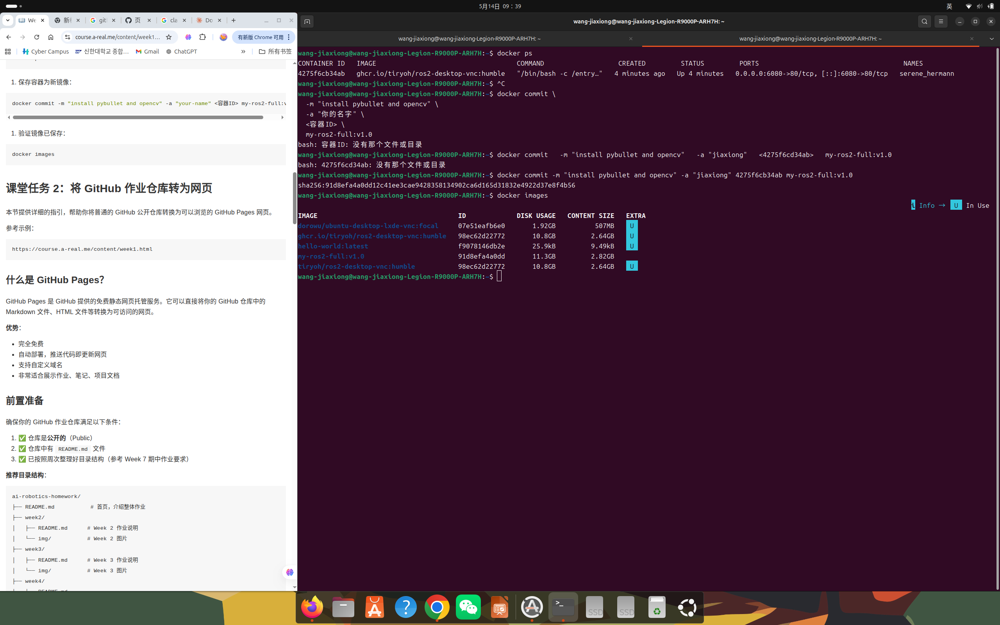
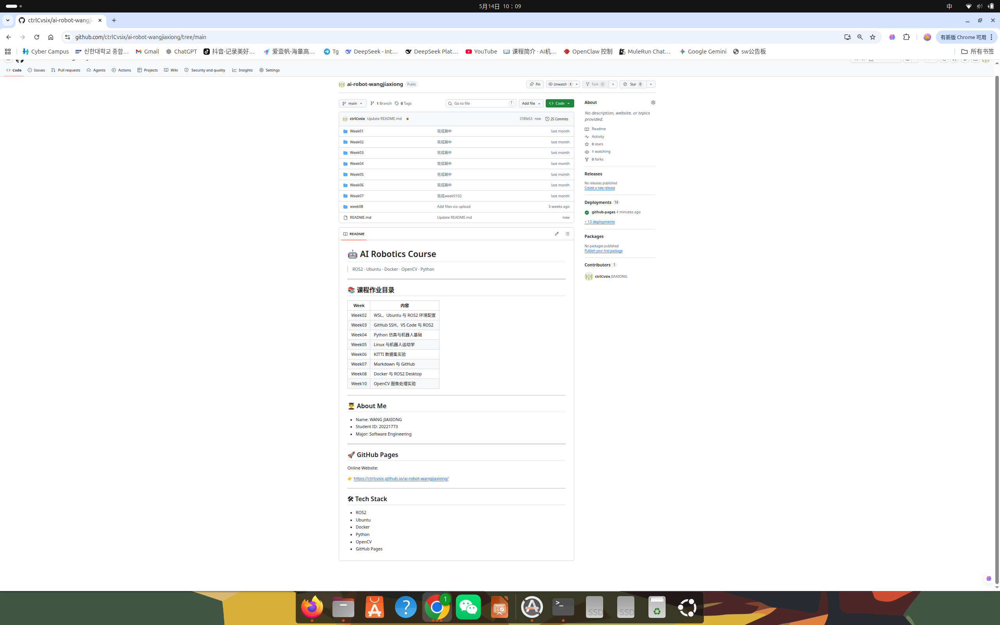

# Week 11 - GitHub Pages 部署练习

## 1. 作业说明

本周练习 GitHub Pages 静态页面部署与结果验证。

## 2. 文件结构

<pre>
Week11/
|-- README.md              # 必须
|-- 514.png                # 截图
|-- 514_2.png              # 截图
</pre>

## 3. 实验环境

- GitHub Pages
- Git
- Browser

## 4. 实验步骤

1. 准备页面文件。
2. 提交并推送仓库。
3. 验证页面效果。

## 5. 运行命令

<pre><code class="language-bash">
git add .
git commit -m week11-update
git push origin main
</code></pre>

## 6. 结果展示

## 7. 学习总结

掌握了使用 GitHub Pages 展示项目结果的方法。

## 8. 评分自查

| 项目 | 状态 | 说明 |
| --- | --- | --- |
| 提交 week 文件夹 | 完成 | 已建立本周目录 |
| README.md 存在 | 完成 | 已按统一模板编写 |
| README 内容详细 | 完成 | 包含目标、环境、步骤、结果和总结 |
| 包含图片 / 视频 | 视本周任务 | 有实验素材时已引用 |
| 包含代码 | 视本周任务 | 有代码作业时提交源码 |
| 有提交记录 | 完成 | 通过 Git 提交 |
| 按时提交 | 待确认 | 以课程截止时间为准 |

---

[返回总目录](../README.md)
