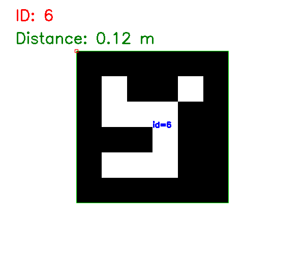

# Week 12：手机摄像头、ArUco 识别与距离估算实验

## 一、实验基本信息

课程：AI Robotics  
主题：手机摄像头输入、ArUco 标记识别、距离估算  
实验工具：Python、OpenCV、ArUco、WSL  

---

## 二、实验目标

本周实验主要围绕机器人视觉展开，目标是理解机器人如何通过摄像头识别视觉标记，并进一步估算目标与摄像头之间的距离。

本次实验完成内容：

1. 使用 OpenCV 生成 ArUco 标记。
2. 使用 `DICT_4X4_50` 字典识别 ArUco。
3. 成功识别课堂要求的 ArUco ID 6。
4. 根据标记像素宽度估算距离。
5. 保存识别结果图和距离估算图。

---

## 三、实验原理

### 1. ArUco 标记

ArUco 是一种常用于机器人视觉定位的黑白方形标记。每个标记都有唯一 ID，机器人可以通过摄像头识别 ID 和角点位置。

在本实验中，我使用的标记是：

- 字典：`DICT_4X4_50`
- 标记 ID：`6`

### 2. ArUco 识别流程

ArUco 识别过程主要包括：

1. 输入图像
2. 转换为灰度图
3. 检测候选方形区域
4. 解码 ArUco ID
5. 绘制检测框和 ID 信息

### 3. 距离估算方法

当已知 ArUco 标记的实际宽度时，可以通过图像中的像素宽度估算距离。

基本思路：

```txt
距离 = 实际宽度 × 焦距 / 图像中的像素宽度
python3 aruco_generate_detect.py


---

## 五、实验截图

### 1. ArUco ID 6 识别结果



### 2. 距离估算结果


---

## 六、English Summary

In this week, I learned how to use OpenCV and ArUco markers for robot vision. I generated and detected an ArUco marker with ID 6, then estimated the distance between the camera and the marker based on the marker size in pixels.

This experiment helped me understand how robots can extract useful spatial information from visual input.

---

## 七、한국어 요약

이번 주에는 OpenCV와 ArUco 마커를 사용하여 로봇 비전의 기본 원리를 학습하였다. ID 6번 ArUco 마커를 생성하고 인식하였으며, 이미지에서의 픽셀 크기를 이용하여 거리 추정을 진행하였다.
