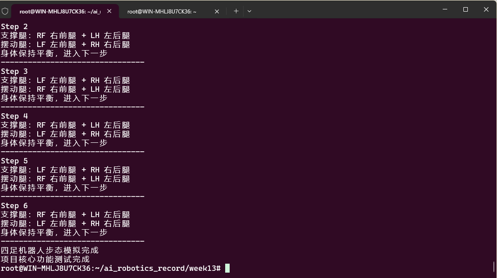

# Week 13 — 四足机器人仿真与步态控制

## 实验目标

在 PyBullet 中加载 Laikago 四足机器人模型，实现 Trot 步态控制器，理解四足机器人的步态相位差与协调运动原理。

## 目录结构

```
Week13/
├── README.md                   # 本报告
├── trot.py                     # Trot 步态控制器
├── quadruped_walk.py           # Walk 步态控制
├── quadruped_project_demo.py   # 项目演示入口
├── img/                        # 实验截图
│   ├── simulation_run.png      # 仿真过程
│   ├── quadruped_concept.png   # 四足机器人概念图
│   └── project_checklist.png   # 项目检查清单
├── demos/                      # 分步演示代码
│   ├── 01_pybullet_box.py      # PyBullet 入门
│   ├── 02_load_laikago.py      # 加载 Laikago 模型
│   ├── 03_sine_gait.py         # 正弦步态控制
│   └── 04_trot_gait.py         # Trot 步态演示
└── scripts/                    # 可视化生成脚本
    ├── generate_gait_gifs.py
    └── generate_gait_diagrams.py
```

## 实验环境

| 组件 | 说明 |
|------|------|
| 仿真引擎 | PyBullet |
| 编程语言 | Python 3 |
| 数值计算 | NumPy |
| 机器人模型 | Laikago URDF（PyBullet 内置） |

## 实验步骤

### 1. 安装依赖

```bash
pip install pybullet numpy
```

### 2. PyBullet 入门

从方块自由落体开始，熟悉 PyBullet 仿真循环：

```bash
python3 demos/01_pybullet_box.py
```

### 3. 加载四足机器人模型

```bash
python3 demos/02_load_laikago.py
```

### 4. 正弦步态实验

用正弦函数控制关节角度，观察对角腿相位差：

```bash
python3 demos/03_sine_gait.py
```

### 5. Trot 步态实现

Trot 步态的核心是对角腿配对（左前+右后 为一组，右前+左后 为另一组），相位差 180°：

```bash
python3 demos/04_trot_gait.py
python3 trot.py
```

## 关键命令

```bash
# 安装依赖
pip install pybullet numpy

# 运行 Trot 步态
python3 trot.py

# 运行 Walk 步态
python3 quadruped_walk.py
```

## 步态原理

四足机器人常见步态及其相位关系：

| 步态 | 占空比 | 相位差 | 特点 |
|------|--------|--------|------|
| **Walk** | > 0.5 | 各腿依次 90° | 至少三足着地，最稳定 |
| **Trot** | ~0.5 | 对角腿同相、异相对角 180° | 两足交替支撑，中速高效 |
| **Bound** | < 0.5 | 前双腿同相、后双腿同相 | 跳跃式前进，高速 |

本实验的 Trot 控制器通过正弦函数生成关节角度，关键参数：

- **步幅 (stride_length)**：控制前进速度
- **抬腿高度 (step_height)**：影响越障能力
- **相位偏移 (phase_offset)**：对角腿差 π，实现交替支撑
- **频率 (frequency)**：控制步态周期

## 实验证据

### 仿真运行


*仿真过程及参数监控*

### 四足机器人概念


*四足机器人步态概念示意图*

### 项目检查清单


n

*项目进度与检查清单*

## 遇到的问题与解决

| 问题 | 原因 | 解决方案 |
|------|------|----------|
| Laikago 模型初始状态导致摔倒 | 默认关节角度不适合站立 | 调整初始关节角度使四足均匀着地 |
| 步态频率过高导致不稳定 | 仿真步长与关节控制频率不匹配 | 降低步态频率或提高仿真步进速率 |
| DIRECT 模式下无法观察 | 无 GUI 渲染，调试困难 | 先用 GUI 模式验证，确认无误后切换 DIRECT |
| 不同步态切换不流畅 | 相位突变导致关节速度跳变 | 在步态切换时对相位进行平滑过渡 |

## 总结与反思

### 核心收获

1. **步态生成原理**：通过正弦函数的相位偏移，仅需少量参数即可生成协调的四足步态。Trot 步态的关键在于对角腿 180° 相位差
2. **PyBullet 仿真流程**：加载模型 → 设置关节控制 → 步进仿真 → 获取状态，这是所有机器人仿真的标准范式
3. **步态选择**：不同步态有不同适用场景 — Walk 稳定低速、Trot 中速高效、Bound 高速冲刺

### 遇到的挑战

- Laikago 模型初始状态可能导致机器人摔倒，需要调整初始关节角度
- 步态参数（频率、幅值）需要在稳定性与速度之间权衡
- 无图形界面（DIRECT 模式）下调试困难，建议先用 GUI 模式验证再切换

---

[返回实验导航](../README.md)
