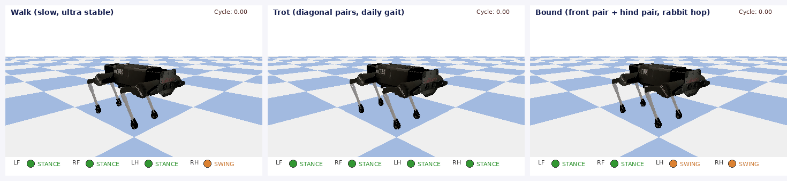
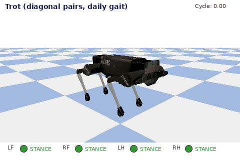
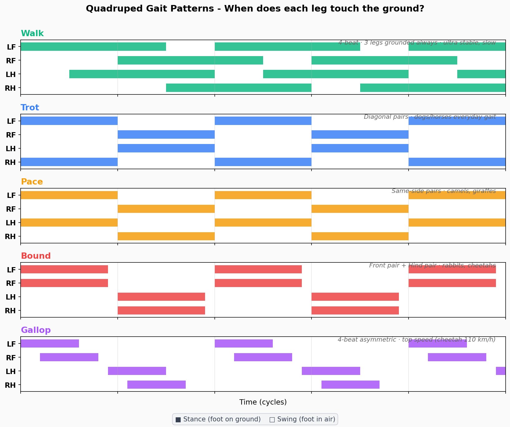
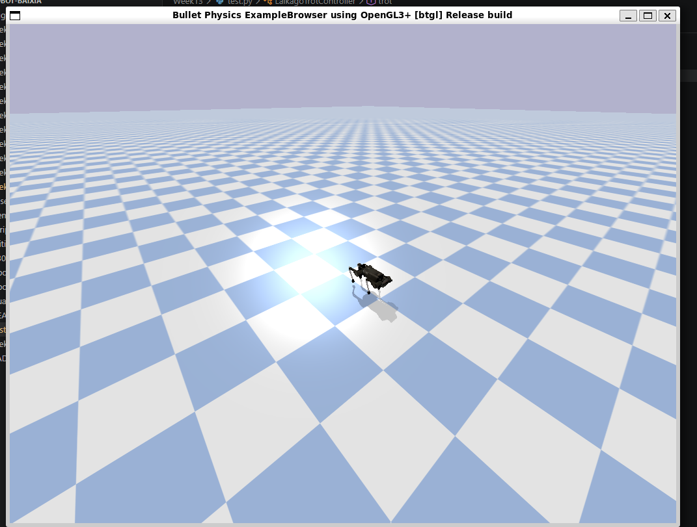
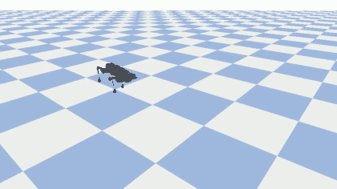
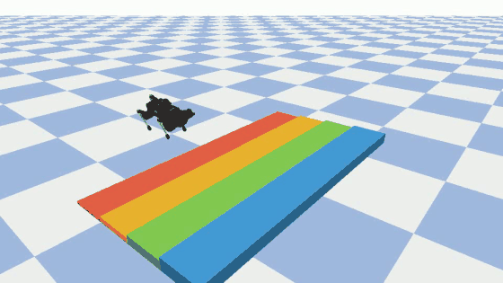

# Week 13 — 四足机器人仿真与步态控制

## 实验目标

在 PyBullet 中加载 Laikago 四足机器人模型，实现 Trot 步态控制器，理解四足机器人的步态相位差与协调运动原理，并使用可视化工具对比不同步态（Walk / Trot / Bound）的运动特性。

## 目录结构

```
Week13/
├── README.md                     # 本报告
├── trot.py                       # Trot 步态控制器
├── quadruped_walk.py             # Walk 步态控制
├── quadruped_project_demo.py     # 项目演示入口
│
├── img/                          # 实验截图
│   ├── img13-1.png               # 仿真运行截图
│   ├── simulation_run.png        # 仿真过程
│   ├── quadruped_concept.png     # 四足机器人概念图
│   └── project_checklist.png     # 项目检查清单
│
├── demos/                        # 分步演示代码
│   ├── 01_pybullet_box.py        # PyBullet 入门：方块自由落体
│   ├── 02_load_laikago.py        # 加载 Laikago 模型
│   ├── 03_sine_gait.py           # 正弦步态控制
│   └── 04_trot_gait.py           # Trot 步态演示
│
├── assets/                       # 可视化素材
│   ├── quadruped_progress_run_12.gif        # 平地跑步训练过程
│   ├── quadruped_stairs_three_steps_progress.gif  # 爬楼梯训练过程
│   ├── quadruped_training_reward_curve.png  # 训练奖励曲线
│   └── gaits/                    # 步态对比图
│       ├── pybullet_compare.gif  # 三种步态对比
│       ├── pybullet_trot.gif     # Trot 步态动画
│       ├── pybullet_walk.gif     # Walk 步态动画
│       ├── pybullet_bound.gif    # Bound 步态动画
│       ├── gait_patterns.png     # 步态相位图
│       └── gait_speed_energy.png # 速度与能耗对比
│
└── scripts/                      # 可视化生成脚本
    ├── generate_gait_gifs.py     # 步态 GIF 生成
    └── generate_gait_diagrams.py # 步态图表生成
```

## 实验环境

| 组件 | 说明 |
|------|------|
| 仿真引擎 | PyBullet |
| 编程语言 | Python 3 |
| 数值计算 | NumPy |
| 机器人模型 | Laikago URDF（PyBullet 内置） |
| 可视化 | imageio / matplotlib |

## 实验步骤

### 1. PyBullet 入门

先从最简单的方块自由落体开始，熟悉 PyBullet 的仿真循环：

```bash
python3 demos/01_pybullet_box.py
```

### 2. 加载四足机器人模型

加载 Laikago 四足机器人 URDF 模型，观察机器人初始姿态：

```bash
python3 demos/02_load_laikago.py
```

### 3. 正弦步态实验

用正弦函数控制各关节角度，观察对角腿的相位差如何产生前进运动：

```bash
python3 demos/03_sine_gait.py
```

### 4. Trot 步态实现

Trot 步态的核心是对角腿配对（左前+右后 为一组，右前+左后 为另一组），两组交替支撑，相位差 180°：

```bash
python3 demos/04_trot_gait.py
python3 trot.py
```

### 5. 步态可视化

生成三种步态（Walk / Trot / Bound）的对比 GIF 和相位图：

```bash
python3 scripts/generate_gait_gifs.py
python3 scripts/generate_gait_diagrams.py
```

## 关键命令

```bash
# 安装依赖
pip install pybullet numpy imageio matplotlib

# 运行 Trot 步态
python3 trot.py

# 运行 Walk 步态
python3 quadruped_walk.py
```

## 步态原理

四足机器人常见步态及其相位关系：

| 步态 | 占空比 | 相位差 | 特点 |
|------|--------|--------|------|
| **Walk** | > 0.5 | 各腿依次 90° | 至少三足着地，最稳定 |
| **Trot** | ~0.5 | 对角腿同相、异相对角 180° | 两足交替支撑，中速高效 |
| **Bound** | < 0.5 | 前双腿同相、后双腿同相 | 跳跃式前进，高速 |

本实验的 Trot 控制器通过正弦函数生成关节角度，关键参数：

- **步幅 (stride_length)**：控制前进速度
- **抬腿高度 (step_height)**：影响越障能力
- **相位偏移 (phase_offset)**：对角腿差 π，实现交替支撑
- **频率 (frequency)**：控制步态周期

## 步态可视化对比

### 三种步态对比



### Trot 步态



### 步态相位图



### 速度与能耗


## 实验证据

### 仿真运行



*Laikago 四足机器人在 PyBullet 中运行 Trot 步态仿真*


*仿真过程及参数监控*

### 平地跑步训练过程



### 爬楼梯阶段性成果



### 训练奖励曲线


## 总结与反思

### 核心收获

1. **步态生成原理**：通过正弦函数的相位偏移，仅需少量参数即可生成协调的四足步态。Trot 步态的关键在于对角腿 180° 相位差
2. **PyBullet 仿真流程**：加载模型 → 设置关节控制 → 步进仿真 → 获取状态，这是所有机器人仿真的标准范式
3. **步态选择**：不同步态有不同适用场景 — Walk 稳定低速、Trot 中速高效、Bound 高速冲刺

### 遇到的挑战

- Laikago 模型初始状态可能导致机器人摔倒，需要调整初始关节角度
- 步态参数（频率、幅值）需要在稳定性与速度之间权衡
- 无图形界面（DIRECT 模式）下调试困难，建议先用 GUI 模式验证再切换

---

[返回实验导航](../README.md)
