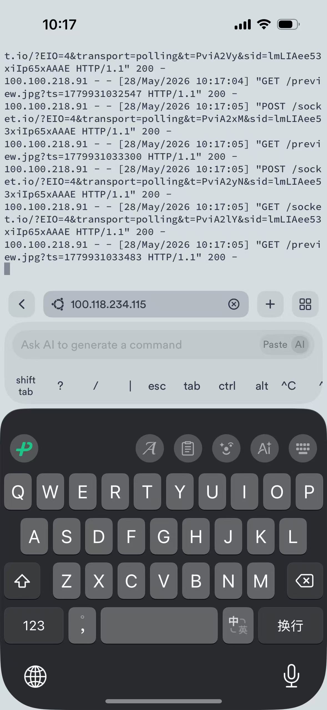
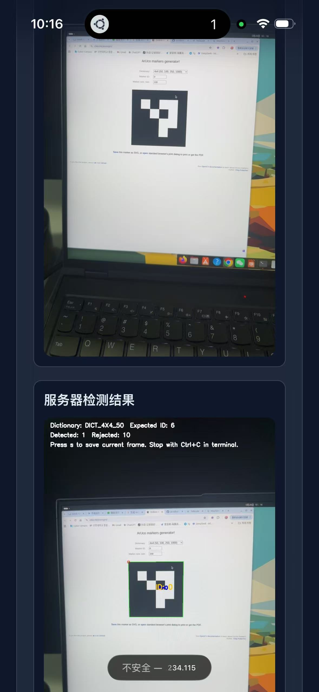

# Week 14 — 期末小组项目：机器狗遥控与乌龟迷宫

## 项目目标

构建「手机网页 → Tailscale 内网穿透 → WSL2 虚拟机 → Docker/ROS2/PyBullet → 仿真机器人」的完整控制链路，支持两种场景：

| 方向 | 场景 | 核心能力 |
|------|------|----------|
| **A — 机器狗仿真** | PyBullet 四足机器人 | AI Agent 决策、手机遥控、迷宫探索 |
| **B — 乌龟迷宫** | TurtleSim + ROS2 | 自主探索算法、Web 可视化控制 |

## 技术栈

### 方向 A：PyBullet 机器狗仿真

| 层级 | 技术 | 用途 |
|------|------|------|
| 仿真引擎 | PyBullet | 四足机器人物理仿真 |
| Web 服务 | Python 3.12 + aiohttp | HTTP/WebSocket 服务端 |
| AI 决策 | DeepSeek API（Agent 模式） | 智能路径规划与指令生成 |
| 前端面板 | `index.html` | 手机浏览器遥控面板 |
| 内网穿透 | Tailscale | 手机端远程访问 |
| 容器化 | Docker | 环境打包与快速部署 |

### 方向 B：TurtleSim 乌龟迷宫

| 层级 | 技术 | 用途 |
|------|------|------|
| 中间件 | ROS2 Humble（Docker） | 话题通信 / 服务调用 |
| 仿真 | TurtleSim | 2D 乌龟运动仿真 |
| 迷宫 | `turtlesim_maze.py` | 迷宫地图生成与碰撞检测 |
| 探索 | `turtlesim_explorer.py` | 自主导航算法 |
| Web 桥接 | `turtlesim_web_bridge.py` | ROS2 ↔ 浏览器 WebSocket 桥接 |
| 前端面板 | `turtlesim_index.html` | Web 控制界面 |

## 系统架构

```
┌──────────────┐     Tailscale      ┌─────────────────────────────────┐
│  手机浏览器   │ ◄──────────────►  │          WSL2 Ubuntu 24.04       │
│              │                   │                                  │
│ • index.html │    100.66.x.x     │  ┌──────────┐  ┌─────────────┐  │
│ • 摇杆/按钮  │                   │  │ PyBullet  │  │ Docker 容器  │  │
│ • 视频回传   │                   │  │ DIRECT 模式│  │ (ROS2)      │  │
└──────────────┘                   │  │ :8765     │  │ :8080, :6080│  │
                                    │  └──────────┘  └─────────────┘  │
                                    └─────────────────────────────────┘
```

| 端口 | 服务 | 说明 |
|------|------|------|
| `8765` | PyBullet Web 控制器 | 方向 A：机器狗遥控面板 |
| `8080` | TurtleSim Web 控制器 | 方向 B：乌龟迷宫控制面板 |
| `6080` | noVNC 桌面 | 远程桌面访问（调试用） |

## 启动命令

```bash
# 方向 A：启动 PyBullet 仿真（Agent 模式）
wsl -d Ubuntu-24.04 -u root bash -c "
  cd /mnt/d/ai-robotics-course/week14_starters/pybullet_dog && \
  DEEPSEEK_API_KEY=sk-xxx PYBULLET_GUI=0 python3 server.py
"

# 方向 B：启动 Docker 容器（TurtleSim）
wsl -d Ubuntu-24.04 -u root bash -c "
  service docker start && \
  cd /mnt/d/ai-robotics-course/week14_starters/docker && \
  docker compose up -d
"

# 查看 PyBullet 日志
wsl -d Ubuntu-24.04 -u root bash -c "cat /tmp/pybullet_wsl.log"
```

## 项目成果

| 文件 | 说明 |
|------|------|
| `Week14_项目报告.pdf` | 完整项目文档（含架构图、流程图、实验结果） |
| `server.py` | PyBullet 仿真 + AI Agent 集成（817 行） |
| `agent.py` | DeepSeek API 驱动的智能决策模块 |
| `maze.py` | 迷宫生成、碰撞检测、路径验证 |
| `explorer.py` | 基于搜索算法的迷宫自主探索器 |
| `index.html` | 手机端机器狗遥控面板 |
| `docker-compose.yml` | ROS2 容器一键部署 |
| `turtlesim_web_bridge.py` | ROS2 ↔ WebSocket 通信桥接 |
| `turtlesim_maze.py` | TurtleSim 迷宫地图模块 |
| `turtlesim_explorer.py` | 乌龟迷宫自主探索算法 |
| `turtlesim_index.html` | 乌龟控制 Web 面板 |

## 关键问题与解决

| 问题 | 原因 | 解决方案 |
|------|------|----------|
| Windows → WSL2 端口不通 | WSL2 使用 NAT，外部无法直连 | 在 Windows 侧配置端口转发规则 |
| Docker 容器重建后依赖丢失 | `docker-compose.yml` 未固化依赖安装步骤 | 将依赖写入 Dockerfile，确保一键可用 |
| PyBullet GUI 资源占用过高 | GUI 渲染消耗大量 CPU/内存 | 设置 `PYBULLET_GUI=0` 切换 DIRECT 模式 |
| DeepSeek API 调用延迟 | 网络延迟 + 长上下文 | 流式响应 + 本地缓存常用指令 |

## 项目总结

本项目打通了从手机网页到仿真机器人的完整链路：Tailscale 组网 → WSL2 虚拟机 → Docker/ROS2 → PyBullet 物理仿真。通过机器狗物理仿真和 TurtleSim 迷宫探索两个互补方向，覆盖了 ROS2 通信、Docker 容器化、Web 全栈、AI Agent 集成、远程组网等全部核心技术。

核心收获：
1. **系统思维**：理解了机器人控制系统的分层架构（感知 → 决策 → 执行）
2. **工程能力**：掌握了 Docker 化部署、端口转发调试、多容器编排
3. **AI 集成**：实践了 LLM Agent 在机器人决策中的具体应用
4. **远程操控**：Tailscale + WebSocket 方案可实现低延迟远程机器人控制

---

## 目录结构

```
Week14/
├── README.md                     # 本报告
├── Week14_项目报告.pdf            # 期末项目完整文档
├── 1.jpeg                        # 实验截图
├── 11.jpeg                       # 实验截图
│
│   # 方向 A：PyBullet 机器狗
├── server.py                     # PyBullet 仿真服务器
├── agent.py                      # DeepSeek AI Agent 控制器
├── maze.py                       # 迷宫地图生成器
├── explorer.py                   # 迷宫自主探索器
├── index.html                    # 手机端机器狗遥控面板
│
│   # 方向 B：TurtleSim 乌龟迷宫
├── turtlesim_web_bridge.py       # ROS2 WebSocket 桥接
├── turtlesim_maze.py             # TurtleSim 迷宫模块
├── turtlesim_explorer.py         # 乌龟迷宫探索算法
├── turtlesim_index.html          # 乌龟控制 Web 面板
│
│   # 部署配置
└── docker-compose.yml            # ROS2 容器编排
```

---



*补充截图：项目运行效果*


*补充截图：系统部署验证*





[返回实验导航](../README.md)
